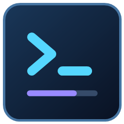

# Codex Usage Desktop

轻量的 Windows 原生 Codex 用量面板。深浅双主题、实时账户额度、本机 Token 统计和额度重置，尽在一个桌面小窗口。



**Windows 10 / 11 · C# / WPF · 免安装 · MIT License**

> 非 OpenAI 官方产品。使用本机 Codex 的登录状态读取额度；本机日志统计不等于账户账单。

## 功能

- 模块化分页：账户额度与本机用量分为两个页签，首页更清爽。
- 账户多额度池、剩余百分比、下次重置时间及可用重置次数。
- 余额折合美元：显示额外 Credits 余额及美元估算值，支持无限额度、未知余额与离线快照。
- 额度重置：确认后使用一次可用重置，超时重试复用同一请求标识。
- 配额深度分析：已用比例、本周已用 Credits、推算总额、周价值（美元估算）。
- 账户本周期明细与历史记录，历史可切换近 7 天 / 近 30 天，显示每日 Credits、Tokens、金额、轮数和合计。
- 今天 / 近 7 天 / 近 30 天的本机用量记录、输入缓存占比、Token 总量和活动图表。
- 模型筛选、最近 8 条记录和当前筛选范围的 CSV 导出。
- 每 60 秒自动刷新，查询失败时标记带时间的日志快照。
- 窗口置顶、系统托盘、手动刷新与可配置数据目录。
- 深色科技风与浅色主题一键切换，自动记住上次选择。
- 定时发送轻量请求：每日自定义多个时间点、可选睡眠唤醒，显示下次执行与上次结果。
- 独立应用图标，覆盖 EXE、任务栏、窗口和托盘，包含 16–256 像素七种尺寸。

## 下载与运行

在本仓库 **Releases** 下载 `CodexUsage-Windows.zip`，解压后双击 `CodexUsage.exe`。无需 Node.js、Python 或 .NET SDK。

运行条件：Windows 10 / 11、.NET Framework 4.5 或以上，以及已经安装并登录的 Codex。本机历史统计需要 Codex 已生成会话日志。

程序会从 PATH 和 Codex 桌面应用安装目录查找 `codex.exe`。也可在“设置 → 指定 codex.exe”中选择。数据目录默认使用 `CODEX_HOME`，未设置时使用 `%USERPROFILE%/.codex`。

| 操作 | 功能 |
| --- | --- |
| 账户额度 / 本机用量 页签 | 在账户模块与本机统计模块之间切换 |
| 拖动标题栏 | 移动窗口 |
| 置顶 | 保持在其他窗口前面 |
| 浅色 / 深色 | 切换主题，并保存选择 |
| 重置额度 | 确认后消耗一次可用重置 |
| — | 收起到系统托盘 |
| 托盘左键单击 | 恢复面板 |
| × / 托盘退出 | 完全退出 |
| 今天 / 近 7 天 / 近 30 天 | 切换本机统计、图表和 CSV 范围 |
| 历史记录：近 7 天 / 近 30 天 | 切换账户历史明细范围（不含本周期） |
| 模型下拉框 | 筛选统计、图表和列表 |
| 导出 CSV | 导出当前时段与模型的全部记录 |

默认不会设置开机启动。配置保存在 `%LOCALAPPDATA%/CodexUsage/settings.json`。

## 定时发送请求

在面板的“设置定时”或“设置 → 定时发送请求”中启用，填写每天的本机时间，例如 `05:00`，或 `05:00, 10:00, 15:00`。保存后从下一个时间点开始，不会立即发送；也可在同一窗口停用。模型可选，留空使用 Codex 默认模型。

每个时间点启动一次 `codex exec`，固定请求“只回复 OK”，使用当前 Codex 数据目录中的 ChatGPT 登录状态。请求运行于独立空目录，使用只读沙箱、临时会话，禁用 shell 工具与交互式审批，不加载用户自定义配置，不使用 API Key 环境变量。需要支持 `--ignore-user-config` 的新版 Codex CLI；认证仍由 Codex 自己处理。

- 默认不开启定时。启用后会创建当前 Windows 用户的任务 `CodexUsage-AutoRequest-<用户 SID>`；不需要提供密码，也不以管理员权限执行。
- 关闭用量面板后 Windows 仍可执行计划，但必须保持当前 Windows 用户登录、电脑开机且网络可用。
- 可勾选尝试唤醒睡眠电脑；唤醒效果取决于设备与 Windows 电源设置，不能从关机状态启动。
- 允许两分钟启动延迟；超过两分钟的错过任务不补发。一次请求最长等待两分钟；失败、超时或结果未确认都不会对同一时间点自动重试。
- 发送前持久化记录，面板与 Windows 任务共享互斥锁，重启后也不会重复执行已开始的同一日期/时间。
- 计划与结果分别保存在 `%LOCALAPPDATA%/CodexUsage/request-schedule.json`、`request-schedule-state.json`。记录只含时间、状态和简短结果，不保存模型输出或登录令牌。移动程序目录后需要重新保存计划，以更新 Windows 任务的程序路径。

定时请求会消耗实际用量，作用是按时发起普通请求。五小时窗口起点、重置时间、周限制由服务端决定，不能保证“05:00 请求一定在 10:00 重置”或“每天得到三份完整额度”；以面板返回的实际重置时间为准。它不会调用额度重置接口或消耗重置券。官方说明：[非交互执行](https://learn.chatgpt.com/docs/non-interactive-mode)、[用量限制](https://learn.chatgpt.com/docs/pricing)。

## 从源码构建

```powershell
powershell -NoProfile -ExecutionPolicy Bypass -File .\build.ps1
```

构建脚本使用 Windows 自带的 .NET Framework C# 编译器。输出在 `dist/`；构建不依赖 NuGet，也不下载第三方运行时。

```powershell
# 回归测试：不访问真实账号或日志
$test = Start-Process .\dist\CodexUsage.exe --self-test -Wait -PassThru
Get-Content .\dist\self-test.txt
if ($test.ExitCode -ne 0) { throw 'Tests failed' }

# 可选：真实连接诊断，结果仅保存在本地
Start-Process .\dist\CodexUsage.exe --diagnose -Wait
```

GitHub Actions 在推送和 Pull Request 时构建、运行解析检查，并提供 Windows 构建产物。

## 数据来源与统计口径

账户额度来自 [Codex App Server](https://learn.chatgpt.com/docs/app-server) 的 `account/rateLimits/read`。本程序不会发起模型任务。

美元余额读取各额度池的 `credits.balance`，按 25 Credits ≈ $1 显示参考价值，同时保留原始 Credits。换算参考 [OpenAI 官方示例](https://developers.openai.com/community/students)（2,500 Credits 等值 $100）；这是额外 Credits 的估算价值，不是 API 现金余额，也不把套餐内百分比折算为美元。未返回或无法解析余额时显示“未提供”，无限额度单独标明；离线余额标注为历史快照，时间沿用所在卡片的日志时间。

### 周价值与月度历史

账户 Credits 查询默认关闭。在“设置 → 账户 Credits 查询（联网）”中确认后开启。该开关不影响本机近 30 天统计、图表和 CSV。接口可用性取决于账号权限和网络环境。

周价值参考截图所示方法：本周期已用 Credits ÷ 周额度已用比例 ÷ 25。它是推算的整周额度价值，不是剩余现金或官方账单。0% 或用量未同步时不推算。账户重置时间决定周期；每日明细采用服务端 UTC 日期，周期首日可能包含重置前用量，因此仅供参考。共享工作区的账户范围可能与个人周额度不同，目前只对已识别的个人套餐推算。

账户明细通过 ChatGPT 网站的 `wham/usage` 和 `wham/analytics/daily-workspace-usage-counts` 只读接口获取，最近 30 天包含今天。它们属于网站内部接口，账号权限、接口变更或网络拦截可能导致不可用；界面会显示原因，不会用本机 Tokens 冒充账户 Credits。布局与推算方法参考[公开实现](https://gist.github.com/yama-lei/0dc1b6a388b7c3e2021341ee34d41c79)。本机月度统计与账户查询独立，CSV 导出仍为所选范围的本机 Token 记录。

### 额度重置操作

点击“重置额度”后，程序重新读取实时状态并弹出确认窗口。确认后调用 `account/rateLimitResetCredit/consume`，由 Codex 服务选择可用重置并决定符合条件的额度窗口；这不是无限刷新额度，也不会清空本机 Token 历史。

- 账号必须有可用重置次数。离线、次数未知或当前 CLI 不返回账户标识时禁用操作。
- 请求发送前，将唯一标识保存到 `%LOCALAPPDATA%/CodexUsage/pending-reset.json`。超时或程序重启后，“重试重置”会复用该标识，避免重复消耗。
- 未确认的请求绑定原账号与数据目录；不能在切换账号后重试到另一账号。
- 服务确认结果后重新读取额度，应用不会自行推算或伪造剩余百分比。
- 该本地文件包含操作标识与账户标识，不包含登录令牌。结果未确认时请勿手动删除它。

自动测试使用模拟接口，不消耗真实重置次数。

本机统计读取 `sessions/` 和 `archived_sessions/` 下的 JSONL 文件：优先使用 `token_usage_record`，按 `response_id` 去重；旧格式采用 `token_count` 累计值的增量。同一文件不同时累计两种格式。按本地时区划分日期。

Token 总量包括缓存输入。缓存占比 = 缓存输入 Token / 全部输入 Token。用量记录数不是完整 API 调用数；列表圆点仅表示有用量记录。未写入日志的请求、缺失日志和其他设备用量不包含在本机统计内。日志格式可能随 Codex 更新而改变。

不提供无法可靠获取的请求成功率、单次请求耗时或 CPA Keeper 数据。实时查询失败时显示历史快照；没有数据时显示未知。

## 隐私

基本额度查询与重置的认证由本机 Codex 进程处理。新增的账户 Credits 明细查询会读取当前数据目录 `auth.json` 中的已有访问令牌和账户标识，仅在内存使用，并只发送到固定的 `https://chatgpt.com/backend-api/wham/` 只读接口；不保存令牌、不记录响应正文、不跟随重定向，不读取对话内容。不上传对话、不收集遥测，也不向项目作者发送数据。CSV 只包含时间、模型和用量数字。使用系统凭据库而未在该文件保存令牌的登录方式暂不支持此明细查询。

诊断文件可能包含用量和套餐信息，请勿直接贴到公开 Issue。构建产物、导出文件、诊断输出、配置与会话目录已由 `.gitignore` 排除。

## 项目结构

```text
App.cs                  数据解析、额度客户端和桌面交互
Main.xaml               深色科技风 WPF 界面
Theme.cs                深浅主题配色
ResetCoordinator.cs     可重试的额度重置与持久化
WeeklyQuota.cs          账户 Credits 明细、周价值估算与 30 天历史
RequestSchedule.cs      定时计划、Windows 任务、执行记录与防重
ScheduleDialog.cs       定时设置窗口
ScheduleTests.cs        定时与任务配置回归测试
FeatureTests.cs         主题、图标和重置回归测试
assets/                 多尺寸 ICO 与 PNG 图标
tools/New-AppIcon.ps1    可复现的图标生成脚本
app.manifest            Windows 权限与 DPI 声明
build.ps1               本地构建脚本
.github/workflows/      Windows 自动构建与检查
LICENSE                 MIT 许可证
```

## 贡献与许可证

欢迎通过 Issue 和 Pull Request 反馈问题或提交改进。提交前请运行构建和解析检查，确保不包含个人日志、凭证、配置或真实账号截图。

本项目采用 [MIT License](LICENSE)。
